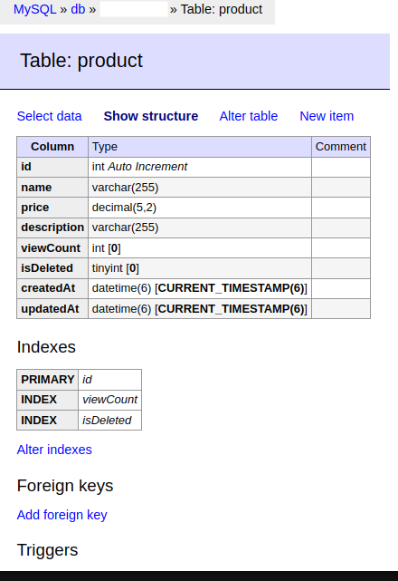

The API application has been built using the [nestjs](https://nestjs.com/) framework which is based on the model of Angular modules and components. [CurrencyAPI](https://currencyapi.com/) has been used to get exchange rates since it provides a free API without credit card use. MySQL is used as the database layer and Redis is used for caching the exchange rates. Please feel free to generate an API and use it in docker-compose.yml file and below commands.

To start the API service, please run below command:

`docker compose up --build`

After a few mins, you can access the application at `http://localhost:3000`

To access the apis, use the postman collection api file in the root of the directory.
The database can be viewed at `http://localhost:8080`. Use the creds from docker-compose.yml file.

Database Schema:

To run the test cases, please run below commands:

1. `docker-compose down`
2. `docker-compose up -d --build db cache`
3. `cd api`
4. `npm i`
5. `export DB_USER=changeme`
6. `export DB_PASS=changeme`
7. `export DB_NAME=changeme`
8. `export CURRENCYAPI_KEY=REPLACE_WITH_YOUR_API_KEY`
9. `npm run test:e2e`